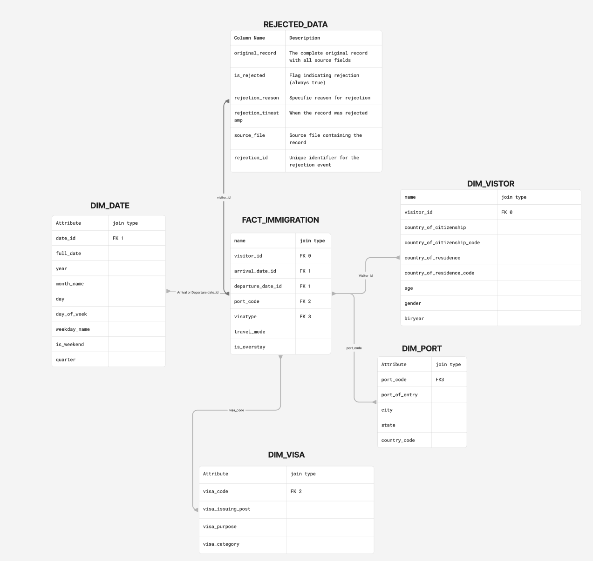
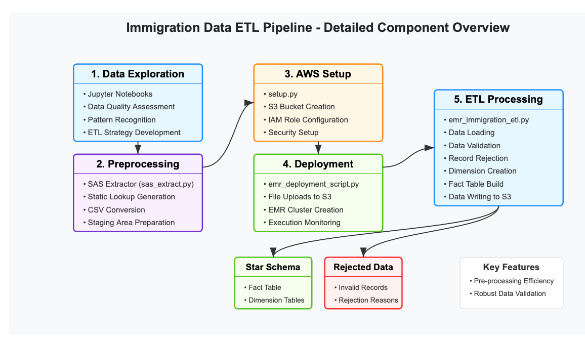

# US Immigration Data ETL Pipeline

## Overview
A scalable data engineering solution that processes US immigration data using AWS EMR and Apache Spark. The system transforms raw data into a star schema optimized for analytics while enforcing robust data quality controls.

Please refer to docs folder to find out more on
1. [Analytical Queries and Data Model Usage](docs/Analytical_Quries.md)
2. [Data Rejection Approach](docs/data_rejection_approach.md)
3. [Immigration ETL Data Quality Procedures](docs/ETL_Data_Quality_Procedures.md)
4. [Implementation Details and Technical Choices](docs/Implementation_Technical_Choices.md)
5. [Product Improvement Recommendations Based on Data Quality Analysis](docs/Product_Improvement.md)

## Business Value
- **Enhanced Decision Making**: Enables data-driven immigration policy analysis
- **Data Quality Assurance**: Identifies and isolates non-compliant records (12% of data) to inform investment in 
  customer exprience to fix these issues at source.
- **Operational Efficiency**: Automates processing of large-scale datasets
- **Compliance Support**: Maintains data lineage and validation for regulatory requirements

## Technical Architecture
- **AWS EMR** for distributed processing with Apache Spark
- **S3 Storage** for raw, staged, and processed data
- **Star Schema Model** optimized for analytical queries
- **Data Quality Framework** with comprehensive validation rules

## Scaling Considerations
The architecture was designed with these scenarios in mind:

### Data Volume Scaling (100x)

- EMR's elastic scaling automatically adds more nodes as data volume increases
- Partition strategy optimized for parallel processing
- Consider EMR Serverless for maximum elasticity with minimal management

### Daily Pipeline Execution (7 AM)

- AWS Step Functions for workflow orchestration ensures reliable scheduling
- Pre-scaling of clusters during known high-volume periods
- SLA monitoring with alert system for potential delays

### Concurrent Access (100+ Users)

- Load processed data to Amazon Redshift for concurrent analytical queries
- Role-based access control for different user groups
- Business intelligence layer with QuickSight dashboards for self-service
- API layer for application-based access

## Data Model
The dimensional model consists of:
- **Fact Table**: fact_immigration (border crossing records)
- **Dimension Tables**: dim_date, dim_visitor, dim_port, dim_visa

### Data Dictionary

### fact_immigration

| Column Name | Data Type | Description |
| --- | --- | --- |
| visitor_id | Integer | Unique identifier for the visitor |
| arrival_date_id | Integer | Foreign key to dim_date (arrival) |
| departure_date_id | Integer | Foreign key to dim_date (departure) |
| port_code | String | Foreign key to dim_port |
| visatype | String | Foreign key to dim_visa |
| travel_mode | String | Mode of travel (Air, Sea, Land, Not reported) |
| is_overstay | Boolean | Flag indicating possible visa overstay |

### dim_date

| Column Name | Data Type | Description |
| --- | --- | --- |
| date_id | Integer | Date ID in format YYYYMMDD (primary key) |
| full_date | Date | Full date in date format |
| year | Integer | Year component |
| month | Integer | Month component (1-12) |
| month_name | String | Month name (January, February, etc.) |
| day | Integer | Day of month (1-31) |
| day_of_week | Integer | Day of week (1-7) |
| weekday_name | String | Day name (Monday, Tuesday, etc.) |
| is_weekend | Boolean | Flag for weekend days |
| quarter | Integer | Calendar quarter (1-4) |

### dim_visitor

| Column Name | Data Type | Description |
| --- | --- | --- |
| visitor_id | Integer | Unique visitor ID (primary key) |
| country_of_citizenship | String | Country of citizenship (mapped from code) |
| country_of_citizenship_code | String | Raw country code |
| country_of_residence | String | Country of residence (mapped from code) |
| country_of_residence_code | String | Raw country code |
| age | Integer | Age of visitor |
| gender | String | Gender |
| biryear | Integer | Birth year |

### dim_visa

| Column Name | Data Type | Description |
| --- | --- | --- |
| visa_code | String | Visa type code (primary key) |
| visa_issuing_post | String | Location where visa was issued |
| visa_purpose | String | Purpose of visa (mapped) |
| visa_category | String | Category of visa |

### dim_port

| Column Name | Data Type | Description |
| --- | --- | --- |
| port_code | String | Port code (primary key) |
| port_of_entry | String | Full port name |
| city | String | City |
| state | String | State |
| country_code | String | Country code (typically 'US') |

### Rejected_data
| Column Name | Description |
|-------------|-------------|
| original_record | The complete original record with all source fields |
| is_rejected | Flag indicating rejection (always true) |
| rejection_reason | Specific reason for rejection |
| rejection_timestamp | When the record was rejected |
| source_file | Source file containing the record |
| rejection_id | Unique identifier for the rejection event |

more info here docs/data_rejection_approach.md




This structure enables analyses such as visitor trends by country, port usage patterns, and visa compliance monitoring.

## Key Components
1. **SAS Extractor**: Processes lookup files for reference data
2. **ETL Core Engine**: Validates, transforms, and loads immigration records
3. **Data Quality Module**: Applies validation rules and manages rejected records
4. **Deployment Orchestrator**: Manages AWS infrastructure and execution

## Data Quality Insights
Analysis revealed significant quality issues, including 386,189 records (12%) with unmapped country codes. This has direct impacts on:
- **Customer Experience**: Application rejections and processing delays
- **Data Integrity**: Incomplete geographic analysis affecting policy decisions
- **System Efficiency**: Technical debt from non-standardized code management

## Scalability Features
- **Elastic Infrastructure**: Dynamically scales with data volume
- **Modular Architecture**: Components can be optimized independently
- **Rejection Handling**: Segregates invalid records for remediation

## Repository Structure
```
immigration-etl-pipeline/
├── README.md                         # Project documentation
├── setup.py                          # AWS infrastructure setup
├── sas_extract.py                    # SAS lookup extractor
├── emr_deployment_script.py          # Deployment orchestration
├── emr_immigration_etl.py            # Core ETL processing
├── docs/                             # Documentation directory
├── notebooks/                        # Exploration notebooks
└── staging/                          # Sample data files
```
#


# ETL Pipeline for Immigration Data
Scalable, AWS-based ETL pipeline for processing, transforming, and storing US immigration data using Spark on EMR

```mermaid
flowchart TD
    subgraph "Preparation Phase"
        A[Data Exploration] -->|Inform ETL Design| B[SAS Extractor]
        B -->|Generate Lookup CSVs| C[Setup AWS Infrastructure]
    end

    subgraph "Deployment Phase"
        C -->|Configure AWS Resources| D[EMR Deployment Script]
        D -->|Upload Files to S3| E[Create EMR Cluster]
        E -->|Submit ETL Job| F[Monitor Execution]
    end

    subgraph "ETL Processing"
        F -->|Spark Job| G[Load Immigration Data]
        G -->|Validate| H[Clean & Transform Data]
        H -->|Create Star Schema| I[Build Dimension Tables]
        I -->|Join Data| J[Build Fact Table]
    end

    subgraph "Output Phase"
        J -->|Write Clean Data| K[Star Schema in S3]
        H -->|Flag Invalid Records| L[Rejected Data in S3]
        F -->|Capture| M[Execution Logs]
    end

    subgraph "Termination Phase"
        K --> N[Terminate EMR Cluster]
        L --> N
        M --> N
        N -->|Success| O[ETL Pipeline Complete]
    end

    classDef preparation fill:#e6f7ff,stroke:#1890ff,stroke-width:2px
    classDef deployment fill:#f9f0ff,stroke:#722ed1,stroke-width:2px
    classDef etl fill:#f6ffed,stroke:#52c41a,stroke-width:2px
    classDef output fill:#fff7e6,stroke:#fa8c16,stroke-width:2px
    classDef termination fill:#fff1f0,stroke:#f5222d,stroke-width:2px

    class A,B,C preparation
    class D,E,F deployment
    class G,H,I,J etl
    class K,L,M output
    class N,O termination
 ```

## Installation and Usage

### Prerequisites
- AWS account with appropriate permissions
- Python 3.7+
- Access to immigration data files

### Setting Up Environment
```bash
# Set AWS credentials
export AWS_ACCESS_KEY_ID="YOUR_ACCESS_KEY_ID"
export AWS_SECRET_ACCESS_KEY="YOUR_SECRET_ACCESS_KEY"
export AWS_SESSION_TOKEN="YOUR_SESSION_TOKEN"  # if using temporary credentials

# Install required packages
pip install boto3 pandas

# Setup AWS infrastructure
python setup.py

# Run the ETL pipeline
python emr_deployment_script.py
```

## Future Enhancements
- Data enrichment with external sources
- Predictive modeling for immigration trends
- Real-time processing capabilities
- Self-service analytics interfaces

---
*Full documentation and detailed implementation files available in the repository.*
